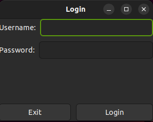
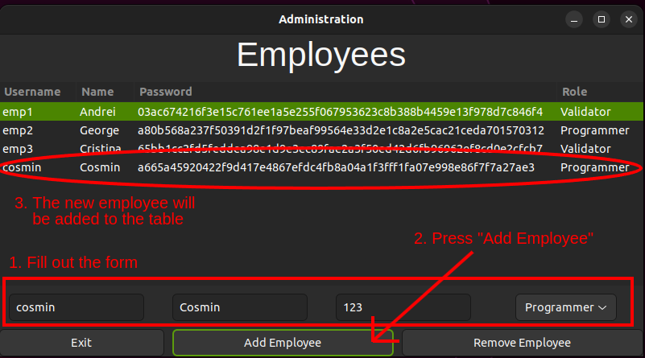
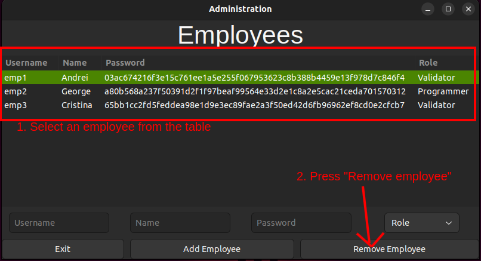
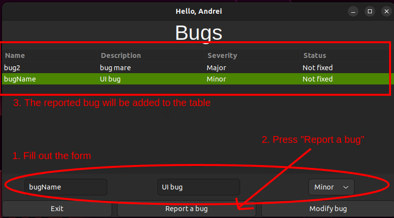
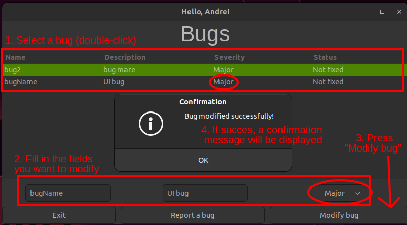
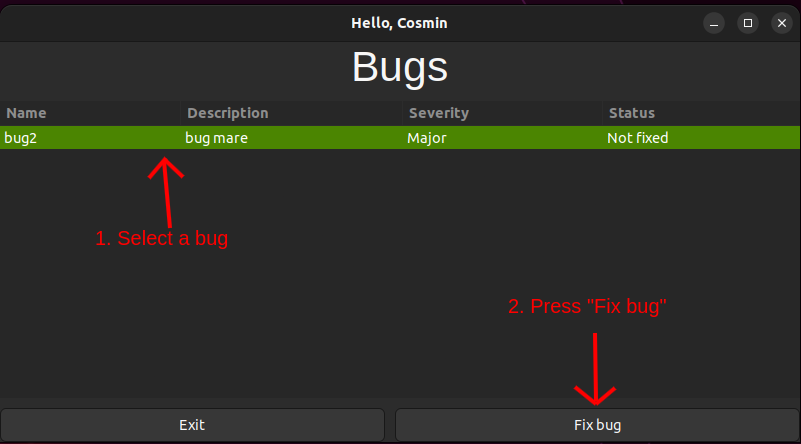
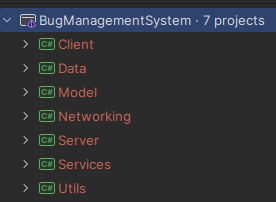

# Bug Management System

## Overview
This project is a client-server application designed to manage bug reports in a software development environment. The system supports different roles (Admin, Programmer, Validator) with specific functionalities for each role. The application uses ProtoBuf for communication between client and server.

## Features
- **User Authentication**: Secure login for employees with different roles.
- **Role-Based Views**:
  - **Admin**: Can add and delete employees (except themselves).
  - **Programmer**: Can view and fix bugs.
  - **Validator**: Can report and modify bugs.
- **Admin Actions**:
  - View employees
  - Add employee (username, name, password, role)
  - Delete employee
- **Programmer Actions**:
  - View reported bugs
  - Fix bugs
- **Validator Actions**:
  - View reported bugs
  - Report bug (name, description, severity)
  - Modify existing bugs
 
## Password Security
- Passwords are hashed using the SHA-256 algorithm before being saved in the database to ensure security.

## Technologies Used
- **Back-end**: C# with Entity Framework Core
- **Database**: SQLite
- **Front-end**: GTK#
- **Data Communication**: ProtoBuf
- **Design Patterns**: Proxy, Observer

## Installation and Setup

### Prerequisites
- .NET SDK
- SQLite

### Steps
1. **Clone the repository**:
    ```bash
    git clone https://github.com/florinacho337/Programare.git
    cd FMI/ANUL\ II/SEM\ 2/MPP/ProiectCSharp/Zboruri
    ```

2. **Configure the Server**:
   - Ensure SQLite is installed.
   - Modify the BugManagementSystemDbContext.cs file located in Data:
     ```c#
     // rest of the file...
     protected override void OnConfiguring(DbContextOptionsBuilder optionsBuilder)
     {
       optionsBuilder.UseSqlite("Data Source=/path/to/cloned/repository/FMI/ANUL II/SEM 2/ISS/BugManagementSystem/Data/bugManagementSystem.db");
     }
     ```
    - Replace '/path/to/cloned/repository' with the actual path where the repository was cloned on your system.

3. **Install Dependencies**:
    - Navigate to each project directory and install dependencies using NuGet:
      ```bash
      cd Data
      dotnet restore
      cd ../Model
      dotnet restore
      cd ../Services
      dotnet restore
      cd ../Networking
      dotnet restore
      cd ../Server
      dotnet restore
      cd ../Client
      dotnet restore
      ```
    

4. **Apply the Latest Migration**:
   - Add and apply the latest migration in the 'Data' directory:
     ```bash
     cd ../Data
     dotnet ef database update
     ```

5. **Build and Run the Server**:
   - Navigate to the server directory and install dependencies using NuGet:
     ```bash
     cd ../Server
     dotnet build
     dotnet run
     ```

6. **Build and Run the Client**:
   - Navigate to the Client directory and build and run the client:
     ```bash
     cd ../Client
     dotnet build
     dotnet run
     ```

## Usage
1. **Login**:
   - Open the client application and log in with your credentials.
   - Use 'admin' as username and 'admin' as password to log in as Admin.
     
      

2. **Admin Actions**:
   - After logging in as Admin, you can add and delete employees.
   - To add an employee, fill out the form with username, name, password, and role.

   - To delete an employee, select them from the table and press "Remove employee"

   

3. **Validator Actions**:
   - After logging in as Validator, you can report bugs.
   - Fill out the form with bug name, description, and severity.

   - You can also modify existing bugs by selecting them from the list and updating their details.


4. **Programmer Actions**:
   - After logging in as Programmer, you can view bugs reported by Validators
   - Select a bug and click "Fix Bug" to mark it as resolved and delete it from the table.


## Project Structure


