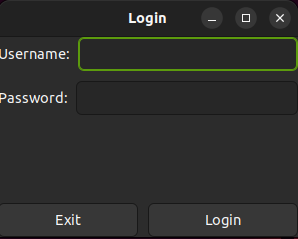
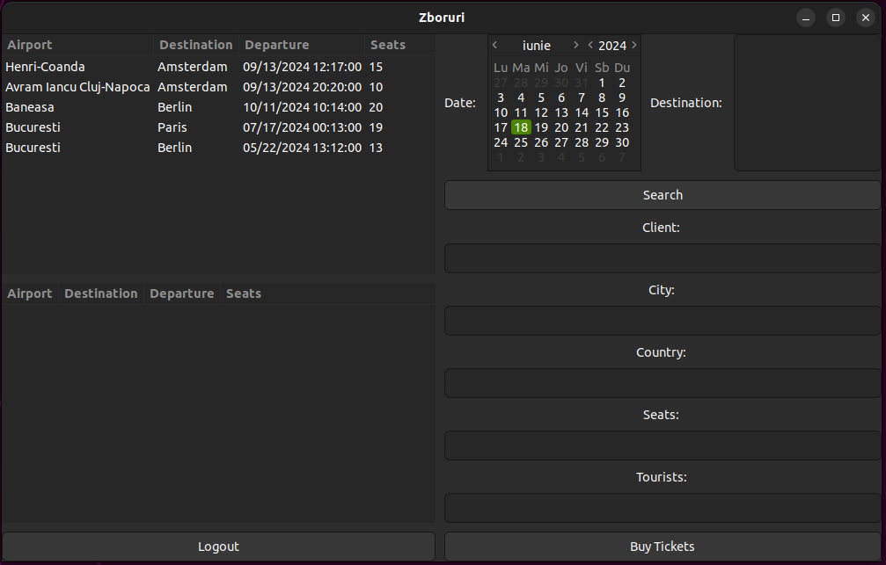
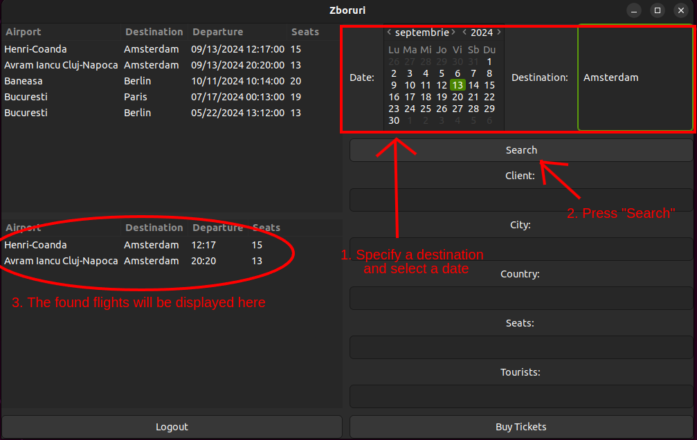
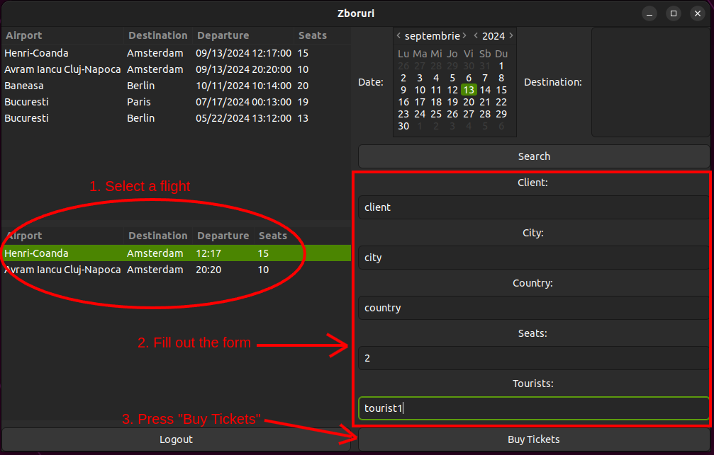
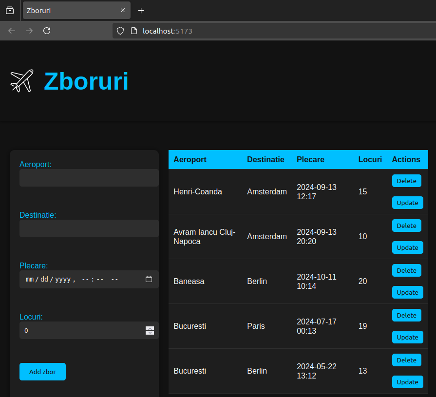
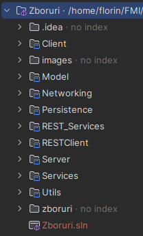

# Travel Agency Ticketing System

## Overview
This project is a client-server application designed for employees of a travel agency to purchase airline tickets for customers. The system allows employees to view available flights, search for flights by date and destination, and purchase tickets for customers. Authentication is required to access the main application window. When purchasing a ticket, employees must fill out a form with customer details.

## Features
- **User Authentication**: Secure login for employees.
- **View Flights**: Display available flights.
- **Search Flights**: Search for flights by specific date and destination.
- **Purchase Tickets**: Fill out a form to buy tickets for customers.
- **REST Services**: Provides REST services for managing flights.
- **React Client**: A React client to interact with the REST services.

## Technologies Used
- **Back-end**: C# with Entity Framework Core
- **Database**: SQLite
- **Front-end**: GTK#
- **REST Services**: ASP.NET Core
- **React Client**: React
- **Data Communication**: JSON
- **Design Patterns**: Proxy, Observer

## Installation and Setup

### Prerequisites
- .NET SDK
- SQLite
- Node.js and npm (for React client)

### Steps
1. **Clone the repository**:
    ```bash
    git clone https://github.com/florinacho337/Programare.git
    cd FMI/ANUL\ II/SEM\ 2/MPP/ProiectCSharp/Zboruri
    ```

2. **Configure the Server**:
   - Ensure SQLite is installed.
   - Modify the app.config file located in Persistence:
     ```xml
     <?xml version="1.0" encoding="utf-8"?>
     <configuration>
       <appSettings>
         <add key="port" value="55556"/>
         <add key="ip" value="127.0.0.1"/>
       </appSettings>
       <connectionStrings>
         <clear />
         <add name="zboruriDB"
              providerName=""
              connectionString="Data Source=/path/to/cloned/repository/FMI/AN II Sem 2/MPP/zboruri.db" /> <!-- change with your path -->
       </connectionStrings>
     </configuration>
     ```
3. **Install Dependencies**:
    - Navigate to each project directory and install dependencies using NuGet:
      ```bash
      cd Model
      dotnet restore
      cd ../Persistence
      dotnet restore
      cd ../Services
      dotnet restore
      cd ../REST_Services
      dotnet restore
      cd ../Networking
      dotnet restore
      cd ../Server
      dotnet restore
      cd ../Client
      dotnet restore
      cd ../Utils
      dotnet restore
      ```

4. **Build and run the Server**:
   - Navigate to the server directory and install dependencies using NuGet:
     ```bash
     cd ../Server
     dotnet build
     dotnet run
     ```

5. **Build and Run the Client**:
   - Navigate to the server directory and install dependencies using NuGet:
     ```bash
     cd ../Client
     dotnet build
     dotnet run
     ```

## Usage
1. **Login**:
   - Open the client application and log in with your credentials.
     
      

2. **View Flights**:
   - Once authenticated, you will see all available flights.


3. **Search Flights**:
   - Use the search feature to find flights by specifying a date and destination.


4. **Purchase Tickets**:
   - Select a flight and fill out the purchase form with customer details to buy tickets.


## REST Services and React Client
### REST Services
The project includes REST services for managing flights, built with ASP.NET Core. These services allow for CRUD operations on flight data.

**Configure and Run REST Services**
1. **Navigate to the REST services directory:**
   ```bash
   cd ../REST_Services
   ```
2. **Install dependencies and run the services:**
   ```bash
   dotnet restore
   dotnet build
   dotnet run
   ```
### React Client
The React client is a web application that interacts with the REST services to manage flight data.
**Configure and Run the React Client**
1. **Navigate to the React Client directory:**
   ```bash
   cd ../zboruri
   ```
2. **Install dependencies and start the client:**
   ```bash
   npm install
   npm run dev
   ```


## Project Structure


