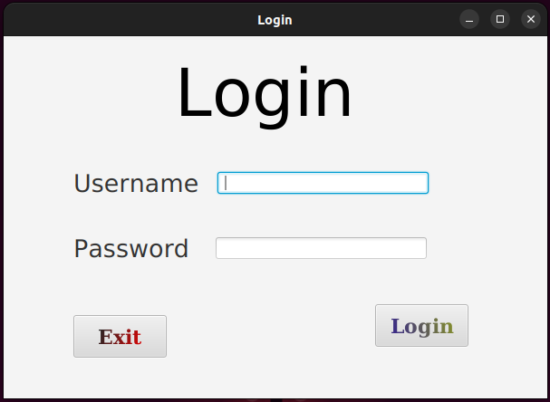
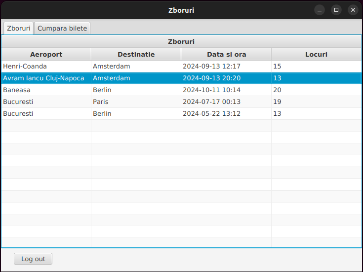
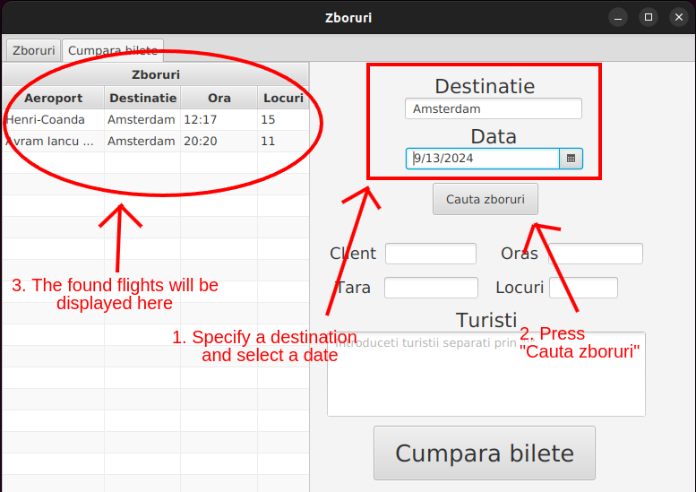
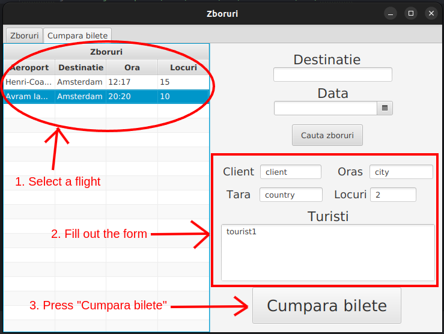
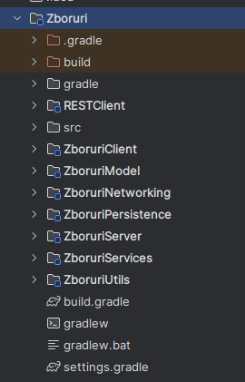

# Travel Agency Ticketing System

## Overview
This project is a client-server application designed for employees of a travel agency to purchase airline tickets for customers. The system allows employees to view available flights, search for flights by date and destination, and purchase tickets for customers. Authentication is required to access the main application window. When purchasing a ticket, employees must fill out a form with customer details.

## Features
- **User Authentication**: Secure login for employees.
- **View Flights**: Display available flights.
- **Search Flights**: Search for flights by specific date and destination.
- **Purchase Tickets**: Fill out a form to buy tickets for customers.

## Technologies Used
- **Back-end**: Java
- **Database**: SQLite
- **Front-end**: JavaFX
- **Data Communication**: JSON
- **Design Patterns**: Proxy, Observer

## Installation and Setup

### Prerequisites
- Java Development Kit (JDK) 8 or later
- SQLite
- Gradle

### Steps
1. **Clone the repository**:
    ```bash
    git clone https://github.com/florinacho337/Programare.git
    cd FMI/ANUL\ II/SEM\ 2/MPP/ProiectJava/Zboruri
    ```

2. **Configure the Server**:
   - Ensure SQLite is installed.
   - Modify the zboruriserver.properties file located in server/src/main/resources:
     ```properties
     zboruri.server.port=55556
     zboruri.jdbc.driver=org.sqlite.JDBC
     # change with your path
     # for Linux systems "\" are not necessary
     zboruri.jdbc.url=jdbc:sqlite:/path/to/cloned/repository/FMI/ANUL\ II/SEM\ 2/MPP/zboruri.db
     ```

3. **Build the Project**:
   - Use Gradle to build the project:
     ```bash
     ./gradlew build
     ```

4. **Run the Server**:
   - Navigate to the server directory and run the server:
     ```bash
     ./gradlew :ZboruriServer:run
     ```

5. **Run the Client**:
   - Navigate to the client directory and run the client:
     ```bash
     ./gradlew :ZboruriClient:run
     ```

## Usage
1. **Login**:
   - Open the client application and log in with your credentials.


2. **View Flights**:
   - Once authenticated, navigate to the "Zboruri" tab to see all available flights.


3. **Search Flights**:
   - Navigate to the "Cumpara bilete" tab and use the search feature to find flights by specifying a date and destination.


4. **Purchase Tickets**:
   - Select a flight and fill out the purchase form with customer details to buy tickets.


## Project Structure


